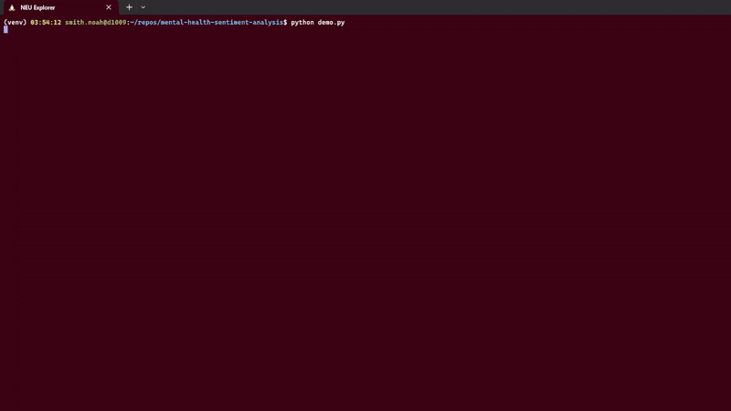

# Mental Health Sentiment Analysis - CS6620 NLP Course Project
This repo has the code for the sentiment analysis of mental health-related text data.  

**Team members:**  
Rajkesh Prakash Shetty  
Noah Smith  
Deepashree Srinivasa Rao Rannore  



## Main Files
```
.
├── README.md
├── data
│   └── mental_health_sentiment_analysis.csv
├── demo.py
├── methods
│   ├── lstm.py
│   ├── tfidf.py
│   └── RoBERTa.py
├── metrics
├── requirements.txt
├── saved_models
│   ├── lstm_model.pkl
│   ├── tfidf_model.pkl
│   └── roberta_model.pth (too large to upload)
├── tests
│   ├── test_methods.pkl
│   └── test_utils.py
└── utils.py
```


## Setup
1. Download/clone the repository
2. Navigate to the project root directory, mental-health-sentiment-analysis
3. Install dependencies: `pip install -r requirements.txt`

A demo script (`demo.py`) has been provided in order to compare the results of all 3 trained models. 

## Commands
- `python demo.py`: Run the demo script to see the results of the pre-trained models.
- `pytest`: Run the tests.
- `python -m methods.tfidf`: Run the TF-IDF model training and evaluation.
- `python -m methods.lstm`: Run the LSTM model training and evaluation.
- `python -m methods.RoBERTa`: Run the RoBERTa model training and evaluation.


## Methods
We implemented three methods for sentiment analysis:

### TF-IDF with Classical ML Classifiers
- File: `methods/tfidf.py`
- Description: This method uses TF-IDF vectorization combined with classical machine learning classifiers like Logistic Regression, SVM, etc.
- Training: `python -m methods.tfidf`
- Model Saving: The trained models are saved in the `saved_models/` directory.

### LSTM-based Neural Network
- File: `methods/lstm.py`
- Description: This method uses an LSTM-based neural network to classify the sentiment of mental health
- Training: `python -m methods.lstm`
- Model Saving: The trained model is saved as `saved_models/lstm_model.pth`

### RoBERTa-based Transformer Model
- File: `methods/RoBERTa.py`
- Description: This method uses a pre-trained RoBERTa transformer model fine-tuned for sentiment analysis.
- Training: `python -m methods.RoBERTa`
- Model Saving: The trained model is saved as `saved_models/roberta_model.pth`


## Notes
- The dataset is included with the code, no separate download needed.
- Trained models are automatically saved to `saved_models/` folder
- The demo script loads existing weights if available
- Delete checkpoint files to retrain models from scratch
- Training generates evaluation metrics in `metrics/` folder
- The RoBERTa model file is too large to upload, please train it locally using the provided script (`python -m methods.RoBERTa`)

